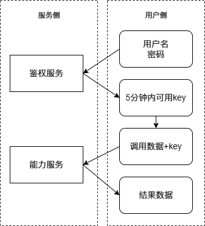

# 调用鉴权

需要先调用鉴权服务API去获取10min内对应的加密key，然后在header中加入鉴权内容（10min内对应的加密key）即可完成API的调用。如果不在header中加入加密key直接调用API则会返回错误。

# 使用方法

### 调用鉴权服务api获取加密key



#### 接口地址：

[http://chunfengai.top:8000](http://chunfengai.top:8000)

#### 接口参数：

类型是form-data

| 参数 | 类型 | 必需 | 备注 |
| :--- | :--- | :--- | :--- |
| username | String | true | 用户名 |
| password | String | true | 密码 |

请联系平台获取贵公司的username、password

**例\(Bash\)**

```bash
curl --location --request GET 'http://chunfengai.top:8000/auth/login' \
    --form 'username="***你的username***"' \
    --form 'password="***你的password***"'
```

**例\(python\)**

```py
import requests

# 替换成你的用户名和密码
username = "***你的username***"
password = "***你的password***"

# 定义登录数据
login_data = {
    'username': username,
    'password': password
}

# 发送 POST 请求
response = requests.post('http://localhost:8000/auth/login', data=login_data)

# 打印响应内容
print(response.text)

#输出示例：{"msg":"成功","ok":true,"data":{"token":"eyJ0eXAiOiJKV1QiLCJhbGciOiJIUzUxMiJ9......"}}

token = response.json()['data']['token']
print(token)
#输出示例："eyJ0eXAiOiJKV1QiLCJhbGciOiJIUzUxMiJ9......"
```

**例\(Java\)**

```java
import java.net.URI;
import java.net.http.HttpClient;
import java.net.http.HttpRequest;
import java.net.http.HttpResponse;
import java.net.http.HttpRequest.BodyPublishers;
import java.net.http.HttpResponse.BodyHandlers;

public class Main {
    public static void main(String[] args) {
        // 替换成你的用户名和密码
        String username = "***你的username***";
        String password = "***你的password***";

        // 创建 HttpClient 实例
        HttpClient client = HttpClient.newHttpClient();

        // 创建 HttpRequest 对象
        String url = "http://chunfengai.top:8000/auth/login";
        HttpRequest request = HttpRequest.newBuilder()
                .uri(URI.create(url))
                .header("Content-Type", "application/x-www-form-urlencoded") // 指定内容类型
                .POST(BodyPublishers.ofString(
                        "username=" + username + "&password=" + password
                ))
                .build();

        try {
            // 发送请求并获取响应
            HttpResponse<String> response = client.send(request, BodyHandlers.ofString());

            // 打印响应内容
            System.out.println(response.body());
        } catch (Exception e) {
            e.printStackTrace();
        }
    }
}
```

**例\(Node\)**

```js
const axios = require('axios');

// 替换成你的用户名和密码
const username = "***你的username***";
const password = "***你的password***";

// 构建查询参数
const params = new URLSearchParams();
params.append('username', username);
params.append('password', password);

// 发送 GET 请求
axios.get('http://chunfengai.top:8000/auth/login', { params: params })
  .then(response => {
    // 打印响应内容
    console.log(response.data);
  })
  .catch(error => {
    // 打印错误信息
    console.error(error);
  });
```

**例\(Js\)**

```js
// 替换成你的用户名和密码
const username = "***你的username***";
const password = "***你的password***";

// 构建查询参数
const queryParams = new URLSearchParams();
queryParams.append('username', username);
queryParams.append('password', password);

// 构建完整的 URL
const url = `http://chunfengai.top:8000/auth/login?${queryParams.toString()}`;

// 发送 GET 请求
fetch(url)
  .then(response => {
    if (!response.ok) {
      throw new Error('Network response was not ok');
    }
    return response.json(); // or response.text() if the response is not JSON
  })
  .then(data => {
    // 打印响应内容
    console.log(data);
  })
  .catch(error => {
    // 打印错误信息
    console.error('There has been a problem with your fetch operation:', error);
  });
```

#### 返回结果

##### 成功:

返回认证需要的token

示例:

```py
{
    "msg": "成功",
    "ok": true,
    "data": {
        "token": "eyJ0eXAiO...你的token..."
    }
}
```

##### 失败:

示例

```py
{
    "msg": "认证错误",
    "ok": false,
    "data": null
}
```

### 服务api调用

在获取到加密key后，将这个加密key加入到header中即可开始能力调用，

##### 请求头

| 参数 | 类型 | 必需 | 备注 |
| :--- | :--- | :--- | :--- |
| Authentication | String | true | 加密key |

##### 示例Bash:

```bash
curl --location 'http://chunfengai.top:8000/***模型接口地址***' \
    --header 'Authorization: eyJ0eXAiO...你的加密key'\
    -d '***调用接口内容***'
```

##### 示例Python:

```py
import requests

# 替换成您的模型接口地址和加密key
model_url = 'http://chunfengai.top:8000/***模型接口地址***'
authorization_token = 'eyJ0eXAiO...你的加密key'

# 定义请求头
headers = {
    'Authorization': authorization_token
}
data = {
    # 定义调用内容的JSON内容
}
# 发送 GET 请求
response = requests.get(model_url, json=data,headers=headers)

# 检查响应状态码
if response.status_code == 200:
    # 请求成功，处理响应内容
    print(response.text)
else:
    # 请求失败，打印错误信息
    print('请求失败，状态码：', response.status_code)
```

##### 示例JS:

```js
// 替换成您的模型接口地址和加密key
const model_url = 'http://chunfengai.top:8000/***模型接口地址***';
const authorization_token = 'eyJ0eXAiO...你的加密key';

// 定义请求头
const headers = {
  'Authorization': authorization_token,
  'Content-Type': 'application/json' // 根据API要求，可能需要设置内容类型
};

// 定义调用内容的JSON内容，这里假设data是一个JSON对象
const data = {
  // 填充需要发送的数据
};

// 发送 GET 请求
fetch(model_url, {
  method: 'GET',
  headers: headers,
  body: JSON.stringify(data), // 如果 GET 请求不需要body，则可以删除此行
})
  .then(response => {
    if (response.ok) {
      // 请求成功，处理响应内容
      return response.json(); // 或者使用 response.text() 如果响应不是 JSON 格式
    } else {
      // 请求失败，抛出错误
      throw new Error('Network response was not ok.');
    }
  })
  .then(data => {
    // 打印响应内容
    console.log(data);
  })
  .catch(error => {
    // 打印错误信息
    console.error('There has been a problem with your fetch operation:', error);
  });
```

我们提供多个能力API，详情请见文档的第４-6章节。

