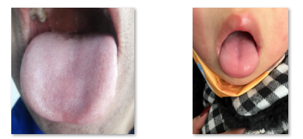
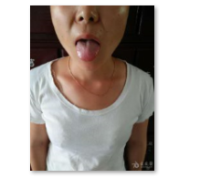

# API说明

舌诊安全性检测api主要用于检测舌象照片的可用性。调用时需要上传舌面照片，舌下照片（可跳过），调用后会返回该图片用于智能舌诊的可用性分析结果（正常舌象图片、非舌象图片）。用户上传照片后，可快速对上传的图片进行判断，如不可用于舌象识别立刻返回错误原因，提升智能舌象识别的准确性。

# 调用地址

> [http://chunfengai.top:8000/cv/tou\_seg](http://chunfengai.top:8000/cv/tou_seg)

# **请求体**

以json的形式发送请求，api接口接受GET或POST请求：

```py
{
    'image':"base64///////",  #必要的
    'location':0,             #必要的
    'age':20,
    'weight':65,  
    'height':180,
    'sex':'M'/'F'
}
```

| 名称 | 类别 | 备注 |
| :--- | :--- | :--- |
| image | string | 必须有 图片的base64编码 |
| location | int | 必须有 0代表舌面1代表舌下 |
| weight | int | 单位是kg |
| height | int | 单位是cm |
| sex | string | M/F |

# **返回**

```python
{
    'success': 0,    
    'info':'拍摄距离过远',
    'error':1
}
```

| 名称 | 类型 | 备注 |
| :--- | :--- | :--- |
| success | int | 成功1失败0 |
| info | string | 中文错误原因 |
| error | int | 见下方表格 |

**说明：**

**在拍摄舌面照片时，若检测到拍摄的为舌底照片，返回：请拍摄舌面照片；**

**在拍摄舌底照片时，若检测到拍摄的为舌面照片，返回：请拍摄舌底照片；**

| **错误原因** | **错误码** |
| :--- | :--- |
| 无异常 | 0 |
| 距离过远 | 1 |
| 拍摄不清晰 | 2 |
| 舌头未伸出 | 3 |
| 请拍摄舌面照片/请拍摄舌底照片 | 4 |
| 传入图像损坏 | 5 |
| 其他错误 | 6 |

# **调用代码--python**

第一步鉴权，获得加密key：

```python
import base64,json,requests
# 以下为鉴权部分
username = "***username***" # 替换成你的用户名
password = "***password***" # 替换成你的密码

# 定义登录数据
login_data = {
'username': username,
'password': password
}
# 发送 POST 请求
response = requests.post('http://chunfengai.top:8000/auth/login', data=login_data)
authorization_token = response.json()['data']['token'] #这里是加密key
```

第二步调用，获得识别结果：

```python
#以下为获得key之后的调用部分
url = 'http://chunfengai.top:8000/cv/tou_seg'
img_path = '1cb6e1a3f71558387e06690846377f05.jpeg'
headers = {
    'Authorization': authorization_token #这里是加密key
}
with open(img_path, 'rb') as f:
    base64image = base64.b64encode(f.read()).decode('utf-8') 
request_param = {'image':base64image,'age':18,'location':0} 
req = requests.post(url, json=json.dumps(request_param),headers=headers)
print(req.json())
# 输出：{'curTime': 1715841851092, 'error': 0, 'info': '无异常', 'success': 1}
```

# **调用代码--JS**

第一步鉴权，获得加密key：

```js
// 以下为鉴权部分
const username = "***username***"; // 替换成你的用户名
const password = "***password***"; // 替换成你的密码

// 定义登录数据
const login_data = {
  'username': username,
  'password': password
};

// 发送 POST 请求
fetch('http://chunfengai.top:8000/auth/login', {
  method: 'POST',
  headers: {
    'Content-Type': 'application/json'
  },
  body: JSON.stringify(login_data)
})
.then(response => {
  if (!response.ok) {
    throw new Error('Network response was not ok');
  }
  return response.json();
})
.then(data => {
  // 假设响应的数据结构为 { "data": { "token": "your_token" } }
  const authorization_token = data.data.token;
  console.log('Authorization token:', authorization_token);

  // 接下来可以使用 authorization_token 进行其他需要认证的请求
})
.catch(error => {
  // 打印错误信息
  console.error('There has been a problem with your fetch operation:', error);
});
```

第二步调用，获得识别结果：

```js
// 以下为获得key之后的调用部分
const url = 'http://chunfengai.top:8000/cv/tou_seg';
const img_path = '1cb6e1a3f71558387e06690846377f05.jpeg';
const authorization_token = '你的授权token'; // 替换成您的授权token

// 读取图像文件并进行 base64 编码
let base64image;
const fs = require('fs');
fs.readFile(img_path, 'binary', (err, file) => {
  if (err) {
    console.error(err);
    return;
  }
  base64image = Buffer.from(file, 'binary').toString('base64');
  // 构建请求参数
  const request_param = {
    image: base64image,
    age: 18,
    location: 0
  };

  // 发送 POST 请求
  fetch(url, {
    method: 'POST',
    headers: {
      'Authorization': authorization_token,
      'Content-Type': 'application/json'
    },
    body: JSON.stringify(request_param)
  })
  .then(response => response.json())
  .then(data => {
    // 请求成功，打印响应内容
    console.log(data);
  })
  .catch(error => {
    // 请求失败，打印错误信息
    console.error('Error:', error);
  });
});
```

# **调用代码--Bash**

第一步鉴权，获得加密key：

```bash
curl --location --request GET 'http://chunfengai.top:8000/auth/login' \
    --form 'username="***你的username***"' \
    --form 'password="***你的password***"'
```

第二步调用，获得识别结果：

```bash
#!/bin/bash

# 替换成您的模型接口地址和加密key
url='http://chunfengai.top:8000/cv/tou_seg'
img_path='1cb6e1a3f71558387e06690846377f05.jpeg'
authorization_token='你的授权token' # 替换成您的授权token

# 读取图像文件并进行 base64 编码
base64image=$( base64 "$img_path" )

# 构建请求参数
request_param=$( jq -n \
  --arg image "$base64image" \
  --arg age 18 \
  --arg location 0 \
  '{
    image: $image,
    age: $age,
    location: $location
  }' )

# 发送 POST 请求
curl -X POST "$url" \
     -H "Authorization: $authorization_token" \
     -H "Content-Type: application/json" \
     -d "$request_param"

# 如果需要检查响应，可以添加响应处理的代码
```

# 测试样例

### 无异常的示例图像



### 距离过远的示例图像



### 舌头未伸出的示例图像


