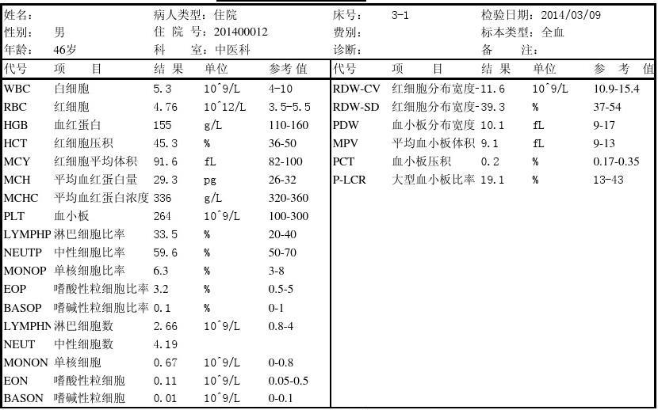

# API说明

OCR（Optical Character Recognition，光学字符识别）技术是一种将各种类型的文档（如扫描的纸质文档、PDF文件或数字相机拍摄的图片）中的文字转换为机器编码的文本的技术。简单来说，OCR技术能够识别图像中的文字，并将其转换成可编辑、可搜索的电子文本数据。

医疗检验报告单OCR（Optical Character Recognition，光学字符识别）算法是专门针对医疗检验报告单的文本识别技术。医疗检验报告单通常包含大量的专业术语和格式规范，因此，需要定制化的OCR算法来提高识别的准确性和效率。医疗检验报告单OCR算法的应用可以大大提高医疗数据处理的效率，减少人工输入的错误，有助于提升医疗服务质量和患者满意度。

# 调用地址

> http://chunfengai.top:8000/ocr/ins_report

# **请求体**

以json的形式发送请求，api接口接受GET或POST请求：

```json
{
    "image":"ABCdef......imagebase64",  //图片的base64编码
    "code":True
}
```

| 名称  | 类别        | 备注                                            |
| :---- | :---------- | :---------------------------------------------- |
| image | string      | 必须有 图像文件的base64编码                     |
| code  | bool 布尔值 | 非必选 默认值为False 是否对输出的报告结果做编码 |

# **返回**

```json
{
      "res": [
              "1. 项目名称:白细胞 单位:10^9/L 参考区间:4-10 结果:5.3",
              "2. 项目名称:红细胞 单位:10^12/L 参考区间:3.5-5.5 结果:4.76",
              "3. 项目名称:血红蛋白 单位:g/L 参考区间:110-160 结果:155",
              "4. 项目名称:红细胞压积 单位:% 参考区间:36-50 结果:45.3",
              "5. 项目名称:红细胞平均体积 单位:fL 参考区间:82-100 结果:91.6",
              "6. 项目名称:平均血红蛋白量 单位:pg 参考区间:26-32 结果:29.3",
              "7. 项目名称:平均血红蛋白浓度 单位:g/L 参考区间:320-360 结果:336",
              "8. 项目名称:血小板 单位:10^9/L 参考区间:100-300 结果:264",
              "9. 项目名称:淋巴细胞比率 单位:% 参考区间:20-40 结果:33.5",
              "10. 项目名称:中性细胞比率 单位:% 参考区间:50-70 结果:59.6",
              "11. 项目名称:单核细胞比率 单位:% 参考区间:3-8 结果:6.3",
              "12. 项目名称:嗜酸性粒细胞比率 单位:% 参考区间:0.5-5 结果:3.2",
              "13. 项目名称:嗜碱性粒细胞比率 单位:% 参考区间:0-1 结果:0.1",
              "14. 项目名称:淋巴细胞数 单位:10^9/L 参考区间:0.8-4 结果:2.66",
              "15. 项目名称:中性细胞数 结果:4.19",
              "16. 项目名称:单核细胞 单位:10^9/L 参考区间:0-0.8 结果:0.67",
              "17. 项目名称:嗜酸性粒细胞 单位:10^9/L 参考区间:0.05-0.5 结果:0.11",
              "18. 项目名称:嗜碱性粒细胞 单位:10^9/L 参考区间:0-0.1 结果:0.01",
              "19. 项目名称:红细胞分布宽度 单位:10^9/L 参考区间:10.9-15.4 结果:11.6",
              "20. 项目名称:红细胞分布宽度 单位:% 参考区间:37-54 结果:39.3",
              "21. 项目名称:血小板分布宽度 单位:fL 参考区间:9-17 结果:10.1",
              "22. 项目名称:平均血小板体积 单位:fL. 参考区间:9-13 结果:9.1",
              "23. 项目名称:血小板压积 单位:% 参考区间:0.17-0.35 结果:0.2",
              "24. 项目名称:大型血小板比率 单位:% 参考区间:13-43 结果:19.1"
      ],
     "pat_info": ["性别:男", "年龄:46岁"],
     "debug":""
 }
```

| 名称     | 类型   | 备注           |
| :------- | :----- | :------------- |
| res      | list   | 报告单结果list |
| pat_info | list   | 患者信息list   |
| debug    | string | debug信息      |

 

# **调用代码--python**

第一步鉴权，获得加密key：

```python
import base64,json,requests
# 以下为鉴权部分
username = "***username***" # 替换成你的用户名
password = "***password***" # 替换成你的密码

# 定义登录数据
login_data = {
'username': username,
'password': password
}
# 发送 POST 请求
response = requests.post('http://chunfengai.top:8000/auth/login', data=login_data)
authorization_token = response.json()['data']['token'] #这里是加密key
```

第二步调用，获得识别结果：

```python
#以下为获得key之后的调用部分
url = 'http://chunfengai.top:8000/ocr/ins_report'
img_path = '1cb6e1a3f71558387e06690846377f05.jpeg'
headers = {
    'Authorization': authorization_token #这里是加密key
}
with open(img_path, 'rb') as f:
    base64image = base64.b64encode(f.read()).decode('utf-8') 
request_param = {'image':base64image,'code':True} 
req = requests.post(url, json=json.dumps(request_param),headers=headers)
print(req.json())
```

# **调用代码--JS**

第一步鉴权，获得加密key：

```js
// 以下为鉴权部分
const username = "***username***"; // 替换成你的用户名
const password = "***password***"; // 替换成你的密码

// 定义登录数据
const login_data = {
  'username': username,
  'password': password
};

// 发送 POST 请求
fetch('http://chunfengai.top:8000/auth/login', {
  method: 'POST',
  headers: {
    'Content-Type': 'application/json'
  },
  body: JSON.stringify(login_data)
})
.then(response => {
  if (!response.ok) {
    throw new Error('Network response was not ok');
  }
  return response.json();
})
.then(data => {
  // 假设响应的数据结构为 { "data": { "token": "your_token" } }
  const authorization_token = data.data.token;
  console.log('Authorization token:', authorization_token);

  // 接下来可以使用 authorization_token 进行其他需要认证的请求
})
.catch(error => {
  // 打印错误信息
  console.error('There has been a problem with your fetch operation:', error);
});
```

第二步调用，获得识别结果：

```js
// 以下为获得key之后的调用部分
const url = 'http://chunfengai.top:8000/ocr/ins_report';
const img_path = '1cb6e1a3f71558387e06690846377f05.jpeg';
const authorization_token = '你的授权token'; // 替换成您的授权token

// 读取图像文件并进行 base64 编码
let base64image;
const fs = require('fs');
fs.readFile(img_path, 'binary', (err, file) => {
  if (err) {
    console.error(err);
    return;
  }
  base64image = Buffer.from(file, 'binary').toString('base64');
  // 构建请求参数
  const request_param = {
    image: base64image,
    code: true,
  };

  // 发送 POST 请求
  fetch(url, {
    method: 'POST',
    headers: {
      'Authorization': authorization_token,
      'Content-Type': 'application/json'
    },
    body: JSON.stringify(request_param)
  })
  .then(response => response.json())
  .then(data => {
    // 请求成功，打印响应内容
    console.log(data);
  })
  .catch(error => {
    // 请求失败，打印错误信息
    console.error('Error:', error);
  });
});
```

# **调用代码--Bash**

第一步鉴权，获得加密key：

```bash
curl --location --request GET 'http://chunfengai.top:8000/auth/login' \
    --form 'username="***你的username***"' \
    --form 'password="***你的password***"'
```

第二步调用，获得识别结果：

```bash
#!/bin/bash

# 替换成您的模型接口地址和加密key
url='http://chunfengai.top:8000/ocr/ins_report'
img_path='1cb6e1a3f71558387e06690846377f05.jpeg'
authorization_token='你的授权token' # 替换成您的授权token

# 读取图像文件并进行 base64 编码
base64image=$( base64 "$img_path" )

# 构建请求参数
request_param=$( jq -n \
  --arg image "$base64image" \
  --arg code true \
  '{
    image: $image,
    code: true
  }' )

# 发送 POST 请求
curl -X POST "$url" \
     -H "Authorization: $authorization_token" \
     -H "Content-Type: application/json" \
     -d "$request_param"

# 如果需要检查响应，可以添加响应处理的代码
```

# 测试样例图片



```json
{      "res": [
              "1. 项目名称:白细胞 单位:10^9/L 参考区间:4-10 结果:5.3",
              "2. 项目名称:红细胞 单位:10^12/L 参考区间:3.5-5.5 结果:4.76",
              "3. 项目名称:血红蛋白 单位:g/L 参考区间:110-160 结果:155",
              "4. 项目名称:红细胞压积 单位:% 参考区间:36-50 结果:45.3",
              "5. 项目名称:红细胞平均体积 单位:fL 参考区间:82-100 结果:91.6",
              "6. 项目名称:平均血红蛋白量 单位:pg 参考区间:26-32 结果:29.3",
              "7. 项目名称:平均血红蛋白浓度 单位:g/L 参考区间:320-360 结果:336",
              "8. 项目名称:血小板 单位:10^9/L 参考区间:100-300 结果:264",
              "9. 项目名称:淋巴细胞比率 单位:% 参考区间:20-40 结果:33.5",
              "10. 项目名称:中性细胞比率 单位:% 参考区间:50-70 结果:59.6",
              "11. 项目名称:单核细胞比率 单位:% 参考区间:3-8 结果:6.3",
              "12. 项目名称:嗜酸性粒细胞比率 单位:% 参考区间:0.5-5 结果:3.2",
              "13. 项目名称:嗜碱性粒细胞比率 单位:% 参考区间:0-1 结果:0.1",
              "14. 项目名称:淋巴细胞数 单位:10^9/L 参考区间:0.8-4 结果:2.66",
              "15. 项目名称:中性细胞数 结果:4.19",
              "16. 项目名称:单核细胞 单位:10^9/L 参考区间:0-0.8 结果:0.67",
              "17. 项目名称:嗜酸性粒细胞 单位:10^9/L 参考区间:0.05-0.5 结果:0.11",
              "18. 项目名称:嗜碱性粒细胞 单位:10^9/L 参考区间:0-0.1 结果:0.01",
              "19. 项目名称:红细胞分布宽度 单位:10^9/L 参考区间:10.9-15.4 结果:11.6",
              "20. 项目名称:红细胞分布宽度 单位:% 参考区间:37-54 结果:39.3",
              "21. 项目名称:血小板分布宽度 单位:fL 参考区间:9-17 结果:10.1",
              "22. 项目名称:平均血小板体积 单位:fL. 参考区间:9-13 结果:9.1",
              "23. 项目名称:血小板压积 单位:% 参考区间:0.17-0.35 结果:0.2",
              "24. 项目名称:大型血小板比率 单位:% 参考区间:13-43 结果:19.1"
      ],
     "pat_info": ["性别:男", "年龄:46岁"],
     "debug":""
 }
```

