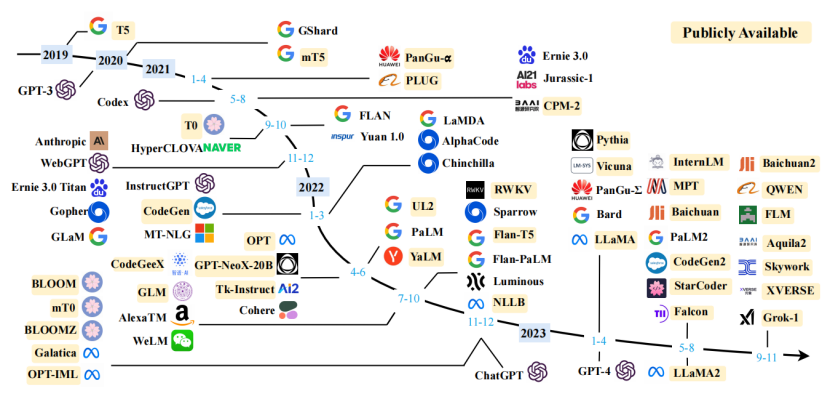

# 公司介绍

方思润博科技（北京）有限公司成立于2019年，是一家专注于AI医疗的前沿科技企业。公司2023年从0到1构建了行业领先的方思基座大模型和萌医医疗大模型，专注于AI医疗数智化的研发与应用。

自2019年成立以来，方思润博科技在AI医疗领域扎根发展，成功推出了10多款数智化医疗产品，包括AI智能辅助诊断助手、导诊助手和智能舌诊产品等，为医疗行业的数智化提供了高效的解决方案。

公司团队汇聚了来自中国科学院、中国中医科学院等顶尖科研机构的专家，以及拥有阿里等大厂背景的资深算法研究员。丰富的专业知识和行业经验，使得方思润博科技在AI医疗科技领域处于领先地位。

目前，方思润博科技与首都医科大学、湖南春播万象科技有限公司、军队及多家科研院所建立了紧密的合作关系，合作单位已达数十家。凭借强大的研发实力和创新能力，公司不断推动AI医疗技术的发展和应用，让每个用户都能够享受科技带来的健康守护。

# 中医大模型相关介绍

中医学，凭借其千年的历史和独特的治疗理念，在现代社会中展现出了独特的魅力和价值。其中，舌诊作为中医诊断方法的核心之一，通过分析舌头的形态、颜色和苔质等特征，有效反映人体整体的健康状况。传统舌诊依赖医生的经验，但是这对于医疗资源相对匮乏的基层来说，是一个不小的挑战。随着人工智能大模型技术的发展，可以将传统深度学习的图像分析技术与语言大模型有机融合，自动解读舌脉特征、检测检验报告、疾病史等，辅助医生或患者进行健康状态的分析。这不仅可以极大提升基层医疗服务的效率和准确性，还使得中医的传统智慧得以在现代医疗环境中发挥更大的价值。

中医大模型系统以GPT舌诊技术为切入口，通过对舌色、苔色、点刺、瘀点、瘀斑、裂纹、齿痕等多达20个维度的细致分析，结合患者的基本信息、身体症状及疾病史，实现对患者健康状况、体质的精准评估。其次，系统还包括了对检测检验报告的智能解读，帮助医生、患者更快更精准的理解和应用报告结果；此外，针对春播特有的中医贴敷技术、体质调理方案进行专业化的定制，因此中医大模型可根据患者的主诉、疾病史、舌脉、检测检验报告等多个维度进行综合分析，提供贴敷治疗、体质调理、经典方剂等多方面的辅助治疗建议。

# 大模型相关介绍

大型语言模型（LLM）是指包含数千亿（或更多）参数的语言模型，这些参数是在大量文本数据上训练的，例如模型 GPT-3、PaLM、Galactica 和 LLaMA。具体来说，LLM 建立在 Transformer 架构之上，其中多头注意力层堆叠在一个非常深的神经网络中。现有的 LLM 主要采用与小语言模型类似的模型架构（即 Transformer）和预训练目标（即语言建模）。作为主要区别，LLM 在很大程度上扩展了模型大小、预训练数据和总计算量（扩大倍数）。他们可以更好地理解自然语言，并根据给定的上下文（例如 prompt）生成高质量的文本。这种容量改进可以用标度律进行部分地描述，其中性能大致遵循模型大小的大幅增加而增加。然而根据标度律，某些能力（例如，上下文学习）是不可预测的，只有当模型大小超过某个水平时才能观察到。 以下是对截止到目前为止国内外所有公开可用大模型的的一些介绍。 表1 近年来大型语言模型（本调查中规模超过10B）的统计数据，包括容量评估、预训练数据规模（以token数量或存储大小表示）以及硬件资源成本。在此表中，我们仅包括那些公开了技术细节的论文中的LLMs。此处，“发布时间”表示相应论文正式发布的日期。“公开可用”意味着模型检查点可以公开访问，而“闭源”则相反。“适应性”表示该模型是否经过后续的微调：IT代表指令调整，RLHF代表带有人类反馈的强化学习。“评估”表示模型是否已在其原始论文中针对相应能力进行了评估：ICL代表上下文学习，CoT代表思维链。“\*”表示最大的公开可用版本。

图1 近年来大型语言模型（模型规模超过10B）的时间线。该时间线主要根据模型的技术论文发布日期（例如，提交至arXiv的日期）设定。如果没有相应的论文，我们将模型的日期定为其公开发布或宣布的最早时间。我们用黄色标记了拥有公开可用模型检查点的LLMs。由于图表空间限制，我们仅包括那些公开报告评估结果的LLMs。

将以上大模型的演进及发展路线可以概括如下：

①**模型架构与预训练：**大型语言模型主要基于Transformer架构，通过自注意力机制（Self-Attention）处理长距离依赖问题。预训练通常涉及无监督学习，如语言模型（Language Modeling）任务，即预测序列中的下一个词。

②**模型规模与性能：**随着模型规模的增加，即参数数量的增加，LLMs在多个NLP任务上的性能得到了显著提升。研究表明，模型规模的增加可以带来更好的模型容量和性能提升。

③**特殊能力：**当模型规模超过某个阈值时，LLMs不仅在性能上有了显著提升，还表现出了一些特殊能力，如上下文学习（In-context Learning），这些能力在小规模语言模型中并不常见。

④**适应性调整：**为了更好地利用LLMs解决特定任务，研究者们通过指令调整（Instruction Tuning）和对齐调整（Alignment Tuning）对模型进行微调，以提高模型在特定任务上的表现。

⑤**模型利用：**LLMs通过自然语言接口进行任务提示（Prompting），可以实现对各种任务的解决。例如，通过将任务描述和示例结合成提示，LLMs可以在没有显式训练的情况下完成新任务。

⑥**安全性与对齐：**LLMs在实际使用中面临安全性挑战，如生成幻觉文本（Hallucination）和有害内容。为了解决这些问题，研究者们采用了如强化学习来自人类反馈（Reinforcement Learning from Human Feedback，RLHF）等对齐方法。

⑦**应用与生态系统：**LLMs在多个实际应用领域展现出潜力，如搜索、推荐系统、教育、医疗和法律等。ChatGPT等模型的出现，已经改变了人们获取信息的方式，并可能对未来的人工智能应用产生深远影响。

⑧**未来方向：**尽管LLMs取得了巨大进步，但仍存在一些挑战和未来的研究方向，如模型效率、长文本处理能力、减少推理成本、提高模型安全性和对齐性等。

⑨**国内外研究：**国际上，OpenAI的GPT系列、Google的BERT、Facebook的RoBERTa等模型在LLMs领域具有重要影响。国内方面，也有研究机构和企业在LLMs领域取得了进展，如百度的文心一言4.0、华为的盘古等。

LLMs的发展正在不断推动自然语言处理技术的边界，同时也带来了对模型性能、安全性和应用范围的深入思考。随着技术的进一步发展，LLMs有望在更多领域发挥更大的作用。

